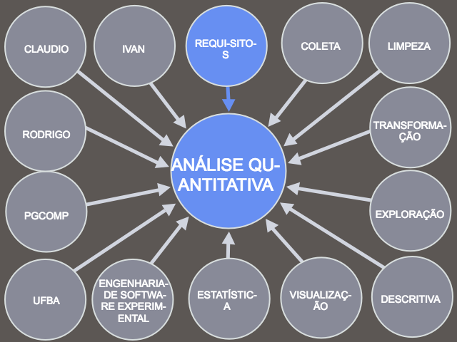
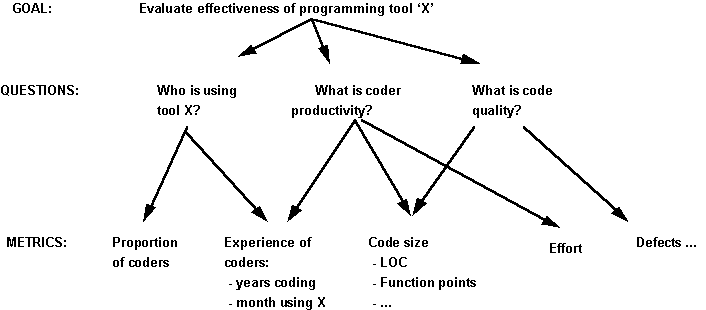
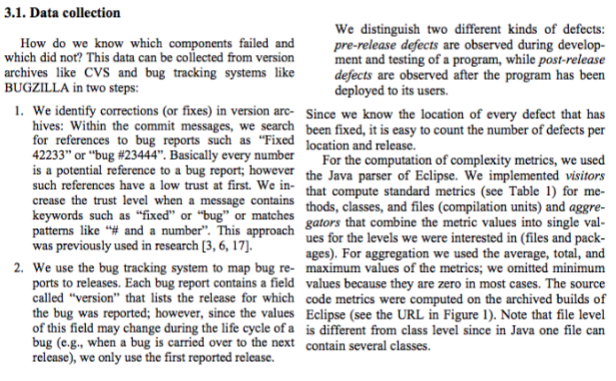

```{r setup, include=FALSE}
# Para instalar os pacotes necessários para executar este código, rode
# o comando a seguir:
#
# install.packages(c("dplyr", "stringr", "knitr", "htmlTable", "corrplot", "moments", "pander"))

knitr::opts_chunk$set(echo = FALSE)
library(dplyr)
library(stringr)
library(knitr)
library(htmlTable)
library(corrplot)
library(moments)

#library(pander)
#mytable <- pander
#mytable <- kable
mytable <- function(x, ...) { knitr::asis_output(paste0("<center>", htmlTable(x, ..., rnames=F, css.cell = "padding-left: .5em; padding-right: .2em;"), "</center>")) }
mycolor <- 'paleturquoise'
mycolor2 <- 'rosybrown2'
mycolor3 <- 'palegoldenrod'
mycolors <- c(mycolor, mycolor2, mycolor3)
set.seed(0)
```

##



## Em que você baseia suas decisões no dia-a-dia?

- intuição?
- dados?

## Como interpretar os dados?

- Exemplo: número de vendas diárias de um app
- Em determinado dia, foram 50 vendas
- Depois de uma campanha de marketing, foram 70 vendas
- Houve um aumento das vendas?
- Depende!

## Análise qualitativa vs. quantitativa

- Qualitativa
    - Dados qualitativos (textos, imagens etc.)
    - Ajuda a formular hipóteses
    - Ex.: [Analyze this! 145 questions for data scientists in software engineering](https://www.microsoft.com/en-us/research/publication/analyze-this-145-questions-for-data-scientists-in-software-engineering/)
- Quantitativa
    - Dados quantitativos (números, contagens)
    - Ajuda a verificar hipóteses
    - Ex.: [Predicting Defects for Eclipse](https://www.st.cs.uni-saarland.de/publications/files/zimmermann-promise-2007.pdf)

## Disciplina e avaliação

- Na maior parte do tempo, não usaremos dados de experimentos
    - Usaremos dados históricos produzidos naturalmente como parte do desenvolvimento de software (código-fonte, bugs, commits etc.)
- Nas partes práticas, usaremos a linguagem R
- **Avaliação**
    - artigo curto com análise quantitativa de um conjunto de dados que será fornecido, usando R
    - apresentação de 5 minutos (ensaiem!)

## Análise de dados

É o processo de inspecionar, limpar, transformar e modelar dados com o objetivo de descobrir informação útil, sugerindo conclusões e dando suporte à tomada de decisão

## Etapas da análise de dados

- *requisitos*
- coleta
- limpeza e transformação
- *análise exploratória*
- modelagem / análise
- comunicação dos resultados

## Requisitos

- De quais dados preciso para atingir meus objetivos?
- De que forma os dados devem estar representados?
- Abordagem GQM (Goal-Question-Metric):



## Coleta: abordagens

- **Manuais**
    - Formulários
    - Entrevistas
    - Observação
- **Automáticas**
    - Instrumentação de software (software que registra o que o usuário faz)
    - Download de arquivos (ex.: dump de banco de dados, exportar como XML…)
    - Acesso a APIs remotas (ex.: GitHub API, Travis CI API)
    - Crawling (pegar informações de páginas na web)

## Coleta: fontes de dados

- Código-fonte (ex.: Java, C, Python)
- Sistemas de controle de versão (ex.: Git, Subversion)
- Gerenciadores de tarefas/bugs (ex.: Bugzilla, Redmine, Jira, GitHub)
- Sistemas de revisão de código (ex.: Gerrit, Review Board)
- Sistemas de integração contínua (ex.: Jenkins, Travis CI, GitLab CI)
- Sites de perguntas e respostas (ex.: StackOverflow)
- Listas de discussão, fóruns e bate-papo (ex.: Mailman, IRC, )
- Sites e wikis
- e outros...

## Coleta

- Coleta de dados históricos pode ser difícil
- Na disciplina vamos usar conjuntos de dados já coletados
- Alguns conjuntos de dados prontos para analisar:
    - <https://rodrigorgs.github.io/msr-datasets>
- Conferência: Mining Software Repositories (todo ano tem MSR Challenge) 

## Coleta: exemplo

- Exemplo: seção 3.1 do artigo [Predicting defects for Eclipse](https://www.st.cs.uni-saarland.de/softevo/bug-data/eclipse/promise2007-dataset-20a.pdf)



## Limpeza

O que fazer com dados...

- incompletos?
    - Ex.: não sei de qual versão é este bug.
- inconsistentes?
    - Ex.: Quem consertou o bug? Commit diz Fulano, bug diz Sicrano.
- que possuem múltiplas representações?
    - Ex.: nome de usuário em SCM, issues e e-mails. “Será que os usuários que mais enviam e-mails introduzem mais bugs no código-fonte?”
- extremos? (outliers)
    - Ex.: Fulano consertou 2 mil bugs em uma hora

## Transformação

- Cálculos simples
    - Ex.: Calcular densidade de bugs a partir de bugs e LOC.
- Operações básicas de bancos de dados
    - Ordenação, filtragem, junção...
- Reshaping
    - Reorganizar os dados. Ver [data wrangling cheat sheet](https://www.rstudio.com/wp-content/uploads/2015/02/data-wrangling-cheatsheet.pdf)
- Agregação de dados
    - Contagem, soma, média...
- Recuperação de informação
    - Extrair dados quantitativos a partir de texto
    - expressões regulares, tf-idf, latent semantic analysis, word cloud, ngrams

## Transformação

- Entrada: tabela
    - cada linha é um registro
    - cada coluna é um atributo
- Operadores: `filter`, `arrange`, `select`, `mutate`, `summarise`, `group_by`, `inner_join`

## Transformação: filter

Seleciona linhas de acordo com critério. Original:

<center>
```{r results='asis'}
dados <- read.csv('data/tamanhos.txt')
mytable(dados)
```
</center>

## Transformação: filter

`filter(versao == 1)`

```{r results='asis'}
mytable(dados, col.rgroup = ifelse(dados$versao == 1, mycolor, 'white'))
```

## Transformação: filter

`filter(versao == 1)`

```{r results='asis'}
dados %>% filter(versao == 1) %>% mytable()
```

## Transformação: arrange

Ordena de acordo o valor de uma ou mais colunas. Original:

```{r results='asis'}
mytable(dados)
```

## Transformação: arrange

`arrange(classe, versao)` - ordena por classe e versao

```{r results='asis'}
dados %>% arrange(classe, versao) %>% mytable()
```

## Transformação: arrange

`arrange(desc(tamanho))` - ordem decrescente de tamanho

```{r results='asis'}
dados %>% arrange(desc(tamanho)) %>% mytable()
```

## Transformação: select

Seleciona colunas. Original:

```{r results='asis'}
mytable(dados)
```

## Transformação: select

`select(classe, tamanho)`

```{r results='asis'}
dados %>% select(classe, tamanho) %>% mytable()
```

## Transformação: mutate

Cria colunas computadas. Original:

```{r results='asis'}
mytable(dados)
```

## Transformação: mutate

`mutate(x = tamanho / versao)`

```{r results='asis'}
dados %>% mutate(x = sprintf("%.1f", tamanho / versao)) %>% mytable()
```

## Transformação: summarise

Combina todos os valores de uma coluna em um único valor (ex.: máximo, mínimo, soma, média...). Original:

```{r results='asis'}
mytable(dados)
```

## Transformação: summarise

`summarise(x = max(tamanho), y = min(tamanho))`

```{r results='asis'}
dados %>% summarise(x = max(tamanho), y = min(tamanho)) %>% mytable()
```

## Transformação: group_by

Agrupa os dados de acordo com o valor de uma coluna.

```{r results='asis'}
mytable(dados)
```

## Transformação: group_by

`group_by(versao)`

```{r results='asis'}
mytable(dados, col.rgroup = mycolors[dados$versao])
```

## Transformação: group_by

`group_by(versao)`

```{r results='asis'}
x <- dados %>% arrange(versao)
x %>% mytable(col.rgroup = mycolors[x$versao])
```

## Transformação: group_by + summarise

`group_by(versao) %>% summarise(total = sum(tamanho))`

```{r results='asis'}
valor <- dados %>%
  group_by(versao) %>%
  summarise(total = sum(tamanho))

valor %>% mytable(col.rgroup = mycolors[valor$versao])
```

## Exemplo: Predicting Eclipse Defects

...

## Análise exploratória

- Ou *exploratory data analysis* (EDA)
- Consiste em sumarizar e visualizar características importantes de um conjunto de dados.
- É útil para levantar hipóteses sobre os dados, identificar problemas com os dados (que requerem limpeza)
- Como:
    - estatística descritiva
    - visualização

## Estatística descritiva

- **Univariada** (uma variável) -- calcular, para cada variável:
    - média, mediana, desvio-padrão, quartis, assimetria, curtose
    - plotar histograma, boxplot, violin plot (talvez usar escala logarítmica)
- **Bivariada** (duas variáveis)
    - correlação/covariância
    - plotar gráfico de dispersão (scatter plot), tabelas de contingência/mosaic plots
    - plotar série temporal (se uma das variáveis for tempo)

## Estatística descritiva: exemplo

Vamos considerar uma tabela com o tamanho (linhas de código, `TLOC`) dos arquivos do código-fonte do programa Eclipse, versão 3.0. Para fins didáticos, usaremos uma amostra aleatória de 9 linhas dessa tabela.

```{r}
f <- gzfile('data/eclipse-metrics.csv.gz')
open(f)
eclipse <- read.csv(f)
close(f)
eclipse3 <- eclipse %>% filter(version == 3.0)
eclipse3 <- eclipse3 %>% mutate(file = sub('^.*/', '', filename))

e3sam <- eclipse3 %>% select(file, TLOC) %>% sample_n(9)
e3sam %>% mytable(align=c('left', 'right'))
TLOC <- e3sam$TLOC
```

## Estatística descritiva univariada

- Vamos começar estudando funções que sumarizam um conjunto de valores através de um único valor representativo
- Exemplo: média, mediana, desvio-padrão, quartis, assimetria, curtose...

## Estatística descritiva: média, desvio-padrão

R possui as funções `mean` (média) e `sd` (desvio-padrão). Para fins didáticos, mostramos como calcular esses valores usando a fórmula:

```{r echo=TRUE}
n <- length(TLOC)
media <- sum(TLOC) / n
desvioPadrao <- sqrt( sum((TLOC - media) ^ 2) / (n - 1) )
```

```{r echo=TRUE}
media
desvioPadrao   # indica o quanto os dados estão "espalhados"
```

## Estatística descritiva: mínimo, máximo

Identifique os valores mínimo e máximo de `TLOC`:

```{r}
e3sam %>% mytable(align=c('left', 'right'))
```

## Estatística descritiva: mínimo, máximo

Fica mais fácil com a tabela ordenada:

```{r}
e3sam %>% arrange(TLOC) %>% mytable(align=c('left', 'right'))
```

- Mínimo: primeiro valor (da tabela ordenada)
- Máximo: último valor (da tabela ordenada)

## Estatística descritiva: mediana

- Mediana: elemento do meio
- Propriedade:
    - 50% dos elementos são menores que a mediana
    - 50% dos elementos são maiores que a mediana

```{r}
e3sam %>% arrange(TLOC) %>% mytable(align=c('left', 'right'))
```

## Estatística descritiva: mediana

```{r}
x <- TLOC %>% sample(8) %>% sort()
```

- E se não tiver elemento do meio?
    - Faz interpolação linear entre os dois elementos do meio.
    - Exemplo: x = `r x`; mediana = `r median(x)`

```{r}
plot(1:length(x), x, type='b', main='', xlab='', ylab='')
abline(v = 0.5 + length(x) /  2, col='red')
```

## Estatística descritiva: média vs. mediana

```{r}
x <- sort(TLOC)
```

- Média e mediana são medidas de tendência central, que sumarizam um conjunto de valores através de um único valor
- A média é mais sensível a valores extremos. Exemplo:
- x = `r x`
    - média = `r mean(x)`, mediana = `r median(x)`
- x = `r x[length(x)] <- x[length(x)]*9; x` (alteramos o último elemento)
    - média = `r mean(x)`, mediana = `r median(x)`
- Não faz sentido falar em média quando os valores são tão variados: basta um milionário virar bilionário para aumentar o PIB per capita, mas isso quer dizer que a população está ganhando mais?

```{r}
x[length(x)] <- x[length(x)] / 9
```


## Estatística descritiva: quartil

- Quartis são pontos que dividem os dados ordenados em 4 partes iguais
- 1º quartil: maior que 1/4 (25%) dos outros valores
- 2º quartil: maior que 2/4 (50%) dos outros valores (mediana)
- 3º quartil: maior que 3/4 (75%) dos outros valores
- mínimo: maior que 0/4 (0%) dos outros valores
- máximo: maior que 4/4 (100%) dos outros valores

## Estatística descritiva: quartil

- x = `r x`; quartis = `r quantile(x, c(0.25, 0.50, 0.75))`

```{r}
plot(1:length(x), x, type='b', main='', xlab='', ylab='')
abline(v=quantile(1:length(x), c(0.25, 0.50, 0.75)), col=c('red', 'darkgreen', 'blue'))
abline(h=quantile(x, c(0.25, 0.50, 0.75)), col=c('red', 'darkgreen', 'blue'))
```

## Estatística descritiva: quantil

- Quartil pode ser generalizado com o conceito de quantil
- ex.:
    - 4-quantil (ou quartil) divide os valores em 4 partes iguais
    - 3-quantil (ou tercil) divide os valores em 3 partes iguais
    - 100-quantil (ou percentil) divide os valores em 100 partes iguais

## Estatística descritiva: percentil

- Ex.: 90º percentil = 9º decil = `r quantile(x, .9)`

```{r}
plot(1:length(x), x, type='b', main='', xlab='', ylab='')
abline(v=quantile(1:length(x), (0:10) / 10), col='darkgreen', lty=2)
abline(v=quantile(1:length(x), 0.9), col='red')
abline(h=quantile(x, 0.9), col='red')
```

## Estatística descritiva: gráficos

- Até agora vimos medidas que sumarizam um conjunto de dados através de um único valor
- Com gráficos, conseguimos visualizar melhor a distribuição dos dados

## Estatística descritiva: histograma

- Divide a faixa de valores em partes iguais e conta quantos valores estão em cada faixa
- Cada faixa de valores é chamada de *bin*.


## Estatística descritiva: histograma

- x = `r x`

```{r echo=TRUE}
hist(x)
```

## Estatística descritiva: histograma

- Outro exemplo (fictício)

```{r}
hist(rnorm(n = 100, sd = 5, mean = 10))
```

## Estatística descritiva: histograma

- Mais um exemplo

```{r echo=TRUE}
hist(eclipse3$PAR_avg)
```

## Estatística descritiva: ecdf

```{r echo=TRUE}
plot(ecdf(eclipse3$FOUT_avg))
```

## Estatística descritiva: assimetria

- A partir do histograma pode-se visualizar como os dados estão distribuídos
- No exemplo anterior, há muito mais valores concentrados nas faixas menores (esquerda) do que nas maiores (direita)
- Dizemos que a distribuição é assimétrica (possui cauda longa)
  - especificamente, assimétrica à direita
- Podemos usar funções da biblioteca `moments` para calcular a assimetria (*skewness*):

```{r echo=TRUE}
skewness(eclipse3$PAR_avg)
```

## Estatística descritiva: curtose

- Indica o quanto a distribuição é espalhada, com valores extremos

```{r echo=TRUE}
kurtosis(eclipse3$PAR_avg)
```


## Estatística descritiva: boxplot

- Boxplot é um tipo de gráfico usado para visualizar a distribuição dos dados a partir de seus **quartis**

## {.flexbox .vcenter}

```{r fig.width=4,fig.height=4, out.width="600px"}
par(mar=c(2, 2, 2, 2))
plot(1:length(x), x, type='b', main='', xlab='', ylab='')
abline(v=quantile(1:length(x), c(0.25, 0.50, 0.75)), col=c('red', 'darkgreen', 'blue'))
abline(h=quantile(x, c(0.25, 0.50, 0.75)), col=c('red', 'darkgreen', 'blue'))
```

## {.flexbox .vcenter}

```{r fig.width=4,fig.height=4, out.width="600px"}
par(mar=c(2, 2, 2, 2))
boxplot(x)
```

## Estatística descritiva: boxplot

- boxplot é bom pra comparar várias distribuições

```{r}
boxplot(Speed ~ Expt, data=morley)
```

## Estatística descritiva: boxplot


## Estatística descritiva: escala logarítmica

Às vezes os dados estão tão espalhados que é difícil visualizá-los.

<center>
```{r fig.width=4,fig.height=4, out.width="400px"}
par(mar=c(2, 2, 2, 2))
boxplot(eclipse3$TLOC)
```
</center>

## Estatística descritiva: escala logarítmica

Uma solução é adotar uma escala logarítmica para os eixos do gráfico:

<center>
```{r fig.width=4,fig.height=4, out.width="400px"}
par(mar=c(2, 2, 2, 2))
boxplot(eclipse3$TLOC, log="y")
```
</center>

## Estatística descritiva bivariada

- Na estatística descritiva bivariada, buscamos entender o relacionamento entre duas variáveis
    - Quando `x` cresce, `y` cresce? (diminui?)
    - `x` e `y` variam na mesma proporção?

## Estatística descritiva: séries temporais

```{r}
x <- mtcars$wt
y <- mtcars$disp
```

```{r}
plot(x, type='l', ylim=c(0,6))
lines(y/100, col='red')
```

## Estatística descritiva: gráfico de dispersão (scatterplot)

```{r}
plot(x, y)
```

## Estatística descritiva: gráfico de dispersão (scatterplot)

```{r}
plot(x, y)
abline(lm(y ~ x), col='red')
```

## Estatística descritiva: correlação

- Correlação: [-1, 1]

```{r echo=TRUE}
cor(x, y)
```

## Estatística descritiva: correlação


## Exemplo: matriz de correlação

```{r}
ecor <- eclipse3 %>% select(post, TLOC, VG_avg, PAR_avg, FOUT_avg)
cor(ecor)
```

## Exemplo: matriz de correlação

```{r}
corrplot(cor(ecor))
```

## Exemplo: scatterplot matrix

```{r}
plot(ecor %>% select(TLOC, VG_avg, PAR_avg) %>% sample_n(200))
```

## Modelagem

- Tirar conclusões a partir dos dados
- Estabelecer causas e efeitos
- Criar um modelo do fenômeno estudado
- (Será tema de outras aulas)

## Comunicação de resultados

- Texto
- Tabelas
- Gráficos
- O objetivo é informar, não enganar!

## Comunicação de resultados: visualização

- O humano não é bom em detectar padrões em conjuntos de muitas informações
- A não ser que essa informação seja apresentada de forma visual
- Visualização significa criar imagens para comunicar informações

## Comunicação de resultados: visualização

- [7 Basic Rules for Making Charts and Graphs](https://flowingdata.com/2010/07/22/7-basic-rules-for-making-charts-and-graphs/)
- [Real Chart Rules to Follow](https://flowingdata.com/2015/08/11/real-chart-rules-to-follow/)
- [Five Ways to Lie with Charts](http://nautil.us/issue/19/illusions/five-ways-to-lie-with-charts)
- [Misleading graph (Wikipedia)](https://en.wikipedia.org/wiki/Misleading_graph)
- [How to Lie With Data Visualization](http://gizmodo.com/how-to-lie-with-data-visualization-1563576606)


---------------


## Ferramentas para análise quantitativa

- Calculadora
- Excel
- Programa Java
- R


